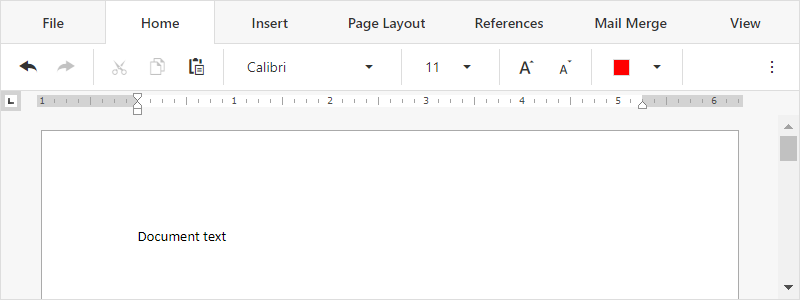

<!-- default badges list -->

[](https://supportcenter.devexpress.com/ticket/details/T884780)
[](https://docs.devexpress.com/GeneralInformation/403183)
<!-- default badges end -->
# Rich Text Editor for ASP.NET Core - Add the control to a React application

This example is a ready-to-use client React application that contains the DevExpress [Rich Text Editor](https://docs.devexpress.com/AspNetCore/400373/office-inspired-controls/controls/rich-edit) control.



Refer to the following topic for more information: [Add RichEdit to a React Application](https://docs.devexpress.com/AspNetCore/401874/rich-edit/get-started/react-application).

## Requirements

* To use the Rich Text Editor control in a React application, you need to have a [Universal, DXperience, or ASP.NET subscription](https://www.devexpress.com/buy/net/).
* Versions of the DevExpress npm packages should match.

## Quick Start

1. Open the root folder in the command prompt and run the following command to install npm packages used in the application:

    ```
    npm install
    ```

2. Execute the following command to compile and run the application:

    ```
    npm start
    ```

## Files to Look At

* [App.js](./src/App.js)

## Documentation

- [Rich Text Editor](https://docs.devexpress.com/AspNetCore/400373/rich-edit)
